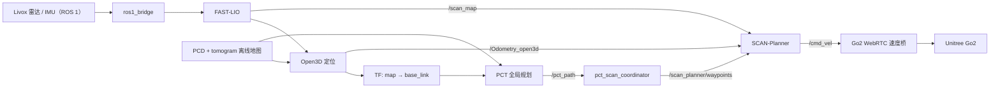

# kn_nav 交接文档（详细版）

> 文档基线：2026-08-13  
> 项目目录（宿主机）：`/home/jetson/kn_nav`  
> 项目目录（容器内）：`/workspace/kn_nav_ws`  
> 当前分支：`master`  
> 当前提交：`16588164d81c0a574c65215fa843100971c87ae0`  
> 当前容器：`kn_nav_container`（运行中）  
> 交接原则：真机首次运行一律先用 `start_go2_bridge:=false` 验证感知、定位和规划，确认无误后再接管底盘。

## 1. 项目简介

### 1.1 项目用途

`kn_nav` 是一套面向 Unitree Go2/Go2-W 四足机器人的 ROS 2 三维导航工作区。当前主链路用于：

1. 通过 ROS 1/ROS 2 动态桥接收 Livox 雷达和 IMU 数据；
2. 使用 FAST-LIO 生成里程计和局部点云；
3. 使用 Open3D 将实时点云与离线 PCD 地图配准，输出 `map -> base_link` 定位；
4. 使用 PCT（Point Cloud Tomography）在离线 tomogram 上进行三维全局路径规划；
5. 使用 SCAN-Planner 根据局部点云避障、生成局部轨迹并输出 `/cmd_vel`；
6. 通过 WebRTC 速度桥把 `/cmd_vel` 发送给 Unitree Go2，并提供 armed、心跳、限速和超时保护。

主数据流如下：



### 1.2 运行平台

| 项目 | 当前实际环境 |
|---|---|
| 宿主机 | Ubuntu 20.04.6 LTS，`aarch64`，Docker 28.1.1 |
| 导航容器 | Ubuntu 22.04.5 LTS，`aarch64` |
| ROS 2 | Humble，`ROS_DOMAIN_ID=0` |
| ROS 1/2 桥 | 独立容器 `ros:foxy-ros1-bridge`，ROS 1 Noetic + ROS 2 Foxy |
| 机器人 | Unitree Go2（现用配置 profile：`unitree_go2`） |
| 雷达数据 | Livox PointCloud2：`/livox/lidar/pointcloud`；IMU：`/livox/imu` |
| 当前镜像 | `kn_nav:v1`，镜像 ID `sha256:89ce472f...6576`，创建于 2026-08-06 |
| 容器网络 | `--network host` |
| GUI | 通过 SSH X11/Xauthority 在容器内启动 RViz2 |
| Open3D | C++ SDK 位于 `/opt/open3d141`；容器 Python `open3d==0.18.0` |
| PCT 第三方库 | `/opt/pct-install` |

注意：仓库中的 `docker/amd/Dockerfile` 是 amd64 参考方案，目录、镜像名和当前 ARM64 部署均不一致，不能视为 `kn_nav:v1` 的可复现构建文件。

### 1.3 主要 ROS 包

当前工作区可被 `colcon` 识别并已安装的包：

- `fast_lio`：激光惯性里程计、局部点云；
- `open3d_loc`：离线 PCD 地图定位、重定位服务；
- `pct_planner`：tomogram 加载、A* 和轨迹优化、发布 `/pct_path`；
- `plan_env`、`path_searching`、`bspline_opt`、`traj_utils`、`scan_planner_msgs`、`scan_planner`：SCAN 局部规划；
- `pct_scan_navigation`：统一 launch、路径协调、地图切换和 Go2 WebRTC 速度桥；
- `livox_ros_driver2`：本工作区中的消息接口包。

`src/pure_pursuit_planner` 当前存在 `COLCON_IGNORE`，没有被构建。当前主链路使用 `pct_scan_navigation/scripts/go2_cmd_vel_bridge.py`，不是 Pure Pursuit 包中的 C++ bridge。

### 1.4 当前状态

结论：**PCT + SCAN 主链路可启动并做过仿真/真机调试，但项目仍属于“可运行、交接资产和部分外围功能未完备”状态。**

已确认：

- Git 工作区在文档编写前为 clean；当前分支是 `master`，不是 `main`；
- `kn_nav_container` 正在运行，工作区已编译，核心 ROS 包可发现；
- 2026-08-12 最近一次日志中，FAST-LIO、Open3D、PCT、SCAN、coordinator、nav manager 和 Go2 bridge 均完成启动；
- 最近一次启动使用了 `bypass_safety:=true`，仅能证明调试链路启动，不能替代正式安全模式验收；
- 最近一次日志出现 `No point, skip this scan`、`no sensor_pose received`，随后才收到 `Odometry_loc`；说明启动早期传感器数据存在等待过程；
- 当前检查时容器中没有导航进程，仅容器本身在运行。

尚未完备或必须补交：

- 当前实际地图 `clean_data.pcd` 和 `clean_data.pickle` 被 Git 忽略，重新 clone 不会得到；
- 当前 ARM64 镜像 `kn_nav:v1` 没有对应的 Dockerfile/镜像导出包或镜像仓库地址；
- 飞书设计文档、历史 Bag 云盘路径、设备清单和网络拓扑尚未提供；
- `navigation_mode:=3` 未实现；
- Web API 代码存在，但当前容器缺少 `fastapi`、`uvicorn`，不属于开箱即用状态；
- `NavigationStatus.msg` 和 Web API 的 `/api/navigation_status` 已定义，但当前主启动链路未找到 `/navigation_status` 发布者；
- 根目录 README 中的 `/pct_scan_navigation/cancel` 与 `/pct_scan_navigation/status` 已和当前实现不一致，停止任务应使用软复位和 bridge disable，见 4.7 节。

### 1.5 导航模式

| 模式 | 参数 | 状态 | 说明 |
|---|---:|---|---|
| SCAN 直接目标 | `navigation_mode:=1` | 可用 | RViz `/goal_pose` 直接交给 SCAN，不启动 PCT 全局规划 |
| PCT + SCAN | `navigation_mode:=2` | 当前默认/主链路 | PCT 发布完整路径，coordinator 采样后交给 SCAN |
| Mode 3 | `navigation_mode:=3` | 未实现 | launch 后 coordinator 会报错并关闭导航 |
| PCT + Pure Pursuit | 独立测试 launch | 当前未构建 | `pure_pursuit_planner` 被 `COLCON_IGNORE`，不要作为交接主链路 |

## 2. 资料与路径

### 2.1 代码与版本

| 资料 | 地址/状态 |
|---|---|
| 本地代码 | `/home/jetson/kn_nav` |
| 容器内代码 | `/workspace/kn_nav_ws`（宿主目录读写挂载） |
| Git 远端 | `https://gitee.com/lion-king2025/3d_nav.git` |
| 分支 | `master` |
| 交接基线提交 | `16588164d81c0a574c65215fa843100971c87ae0` |
| 基线提交说明 | `feat(go2_bridge): add bypass_safety mode and widen 4G WebRTC timeouts` |
| 基线提交时间 | 2026-08-12 18:38:41 +0800 |
| 设计文档 | **待补充飞书文档地址、访问权限和文档所有人** |

接手后先执行：

```bash
cd /home/jetson/kn_nav
git status
git branch --show-current
git remote -v
git log -1 --oneline
```

### 2.2 仓库内文档

| 内容 | 路径 |
|---|---|
| 项目总览 | `README.md` |
| 统一导航说明 | `src/pct_scan_navigation/README.md` |
| PCT 说明 | `src/PCT_planner/README.md` |
| PCT 环境 | `src/PCT_planner/SETUP.md` |
| PCT 参数 | `src/PCT_planner/PARAMETERS.md` |
| Open3D/FAST-LIO 说明 | `src/FAST_LIO_LOCALIZATION_HUMANOID/README.md` |
| SCAN 说明 | `src/SCAN-Planner/README.md` |
| ROS 2 服务 | `src/tools/ros2_service_api.md`、`src/service.md` |
| Web API | `src/web_api/API.md`、`src/web_api/STARTUP.md` |
| amd64 镜像参考 | `docker/amd/Dockerfile`、`docker/amd/README.md` |

### 2.3 关键配置

当前真机 profile 为：

```text
src/pct_scan_navigation/config/unitree_go2/
```

| 配置文件 | 主要内容 | 换地图/换设备时是否必查 |
|---|---|---|
| `map_profiles.yaml` | 地图名称、PCD、tomogram、定位阈值 | 必查 |
| `open3d_loc.yaml` | PCD 路径、初始位姿、ICP 阈值、IMU/base 外参 | 必查 |
| `pct_global_planner.yaml` | tomogram 路径、TF、输入输出 topic、规划行为 | 必查 |
| `fast_lio.yaml` | 雷达/IMU topic、雷达类型、Lidar-IMU 外参 | 必查 |
| `scan_planner.yaml` | 机器人包络、局部地图、速度/加速度、终点容差 | 必查 |
| `go2_bridge.yaml` | Go2 IP、速度限制、安全超时 | 真机必查 |
| `coordinator.yaml` | 全局路径、waypoint 间距和高度偏移 | 路径表现异常时检查 |
| `kn_nav.rviz` | RViz2 显示项 | 一般无需修改 |

当前关键值：

- Go2 IP：`192.168.123.161`；
- PCD：`/workspace/kn_nav_ws/src/PCT_planner/rsc/pcd/clean_data.pcd`；
- tomogram：`/workspace/kn_nav_ws/src/PCT_planner/rsc/tomogram/clean_data.pickle`；
- 全局坐标系：`map`；机器人坐标系：`base_link`；
- FAST-LIO 输入：`/livox/lidar/pointcloud` 和 `/livox/imu`；
- SCAN 最大速度：`0.30 m/s`；Go2 bridge 最大前向速度：`0.40 m/s`；
- 正式安全模式超时：`command_timeout=0.3 s`、`odometry_timeout=1.0 s`、`sport_state_timeout=0.5 s`。

换地图时，以下三个文件里的路径必须保持一致：

1. `map_profiles.yaml` 的 `pcd_path` 和 `tomo_path`；
2. `open3d_loc.yaml` 的 `path_map`；
3. `pct_global_planner.yaml` 的 `tomo_path`。

PCD 和 pickle 必须由同一坐标系、同一版地图生成，文件名相同不代表坐标一定匹配。

### 2.4 地图、Bag 和日志

当前地图目录：

```text
/home/jetson/kn_nav/src/PCT_planner/rsc/pcd/
/home/jetson/kn_nav/src/PCT_planner/rsc/tomogram/
```

当前主链路使用：

| 文件 | 大小约 | Git 状态 |
|---|---:|---|
| `rsc/pcd/clean_data.pcd` | 269 MiB | 被忽略，不随 clone 获取 |
| `rsc/tomogram/clean_data.pickle` | 2.6 MiB | 被忽略，不随 clone 获取 |

目录中还存在 `office_room`、`dinggu7_6` 等历史文件，但没有资料能证明哪一个对应正式场地，**不得凭文件名直接用于真机**。

历史 Bag：**本机项目目录未发现可交接 Bag，飞书云盘路径待补充。** 需要补充日期、场景、ROS 1/ROS 2 格式、成功/失败标签和对应代码提交。

运行日志：

```text
/home/jetson/kn_nav/src/log/run_YYYYMMDD_HHMMSS/
/home/jetson/kn_nav/src/log/latest -> 最近一次运行目录
```

统一 launch 最多保留最近 20 个 `run_*` 目录。排障前先复制需要长期保留的日志，避免被轮转删除。

### 2.5 容器和镜像

当前容器挂载关系：

```text
/home/jetson/kn_nav  -> /workspace/kn_nav_ws  (RW)
/dev/shm             -> /dev/shm              (RW)
```

代码在容器内的修改会直接改到宿主机，不要把容器当成隔离副本。

当前镜像未发现可靠的重建来源。交接前建议至少完成其中一项：

```bash
# 方案 A：导出当前可运行镜像
docker save -o kn_nav_v1_arm64_20260813.tar kn_nav:v1
sha256sum kn_nav_v1_arm64_20260813.tar > kn_nav_v1_arm64_20260813.tar.sha256

# 方案 B：补充 ARM64 Dockerfile，并在干净机器重新构建、验证
```

镜像文件较大，不应提交 Git，应放交接云盘/镜像仓库，并在本文档补充下载地址和校验值。

## 3. 环境搭建教程

### 3.1 推荐方式：复用当前 `kn_nav:v1` 镜像

1. 确认宿主机已安装 Docker，并存在镜像：

   ```bash
   docker --version
   docker image inspect kn_nav:v1
   ```

2. 首次创建容器。`~/kn_nav` 必须是宿主机上的实际项目目录：

   ```bash
   docker run -it --network host \
     -e ROS_DOMAIN_ID=0 \
     -e DISPLAY=$DISPLAY \
     -e XAUTHORITY=/workspace/kn_nav_ws/xauth_host \
     -v /dev/shm:/dev/shm \
     -v ~/kn_nav:/workspace/kn_nav_ws \
     --name kn_nav_container \
     kn_nav:v1 \
     bash
   ```

   容器名已存在时不要重复 `docker run`，直接执行第 3 步。

3. 启动并进入容器：

   ```bash
   docker start kn_nav_container
   docker exec -it kn_nav_container bash
   ```

4. 每个新终端都加载环境：

   ```bash
   cd /workspace/kn_nav_ws
   source /opt/ros/humble/setup.bash
   source install/setup.bash
   export Open3D_DIR=/opt/open3d141/lib/cmake/Open3D
   export THIRDPARTY_ROOT=/opt/pct-install
   export ROS_DOMAIN_ID=0
   ```

   建议把以上内容保存成项目专用脚本后再 source，但不要盲目覆盖镜像已有的 `/root/.bashrc`。

5. 自检依赖和编译结果：

   ```bash
   test -f /opt/open3d141/lib/cmake/Open3D/Open3DConfig.cmake
   test -d /opt/pct-install
   test -f /workspace/kn_nav_ws/install/setup.bash
   ros2 pkg prefix pct_scan_navigation
   ros2 pkg prefix pct_planner
   ros2 pkg prefix scan_planner
   ros2 pkg prefix fast_lio
   ros2 pkg prefix open3d_loc
   ```

6. 验证外网（仅用于诊断，导航运行不应依赖公网）：

   ```bash
   curl -I --connect-timeout 5 https://www.github.com
   ```

### 3.2 从源码重建工作区

> 当前 ARM64 镜像构建文件缺失，以下是依据当前工作区和仓库文档整理的源码重建步骤。必须在另一台干净 ARM64 机器完成一次验证后，才能称为完全可复现。

1. 安装 Ubuntu 22.04、ROS 2 Humble、colcon 和 rosdep。

2. 安装常用系统依赖：

   ```bash
   sudo apt update
   sudo apt install -y \
     build-essential cmake git pkg-config \
     python3-colcon-common-extensions python3-pip python3-rosdep \
     libeigen3-dev libpcl-dev libopencv-dev libboost-all-dev \
     libyaml-cpp-dev libc++-dev libc++abi-dev \
     ros-humble-pcl-ros ros-humble-cv-bridge \
     ros-humble-image-transport ros-humble-tf2-ros
   ```

3. 安装项目 ROS 依赖：

   ```bash
   cd /workspace/kn_nav_ws
   source /opt/ros/humble/setup.bash
   rosdep install --from-paths src --ignore-src -r -y \
     --skip-keys "livox_ros_driver2 unitree_sdk2"
   ```

4. 安装 Python 依赖：

   ```bash
   python3 -m pip install numpy scipy open3d pyyaml
   ```

   若启用 `src/web_api/ros2_service_api.py`，还需安装其实际导入依赖（至少 `fastapi`、`uvicorn`）。当前容器未安装这两项，安装前应先补一份锁定版本的 requirements 文件并做回归。

5. 安装架构匹配的 Open3D C++ SDK、PCT 第三方库和 `unitree_webrtc_connect`。当前运行路径约定为：

   ```bash
   export Open3D_DIR=/opt/open3d141/lib/cmake/Open3D
   export THIRDPARTY_ROOT=/opt/pct-install
   ```

   不要把 amd64 的 Open3D 预编译包复制到 ARM64 环境。

6. 首次编译 PCT C++/pybind 第三方模块：

   ```bash
   cd /workspace/kn_nav_ws/src/PCT_planner/planner
   bash build_thirdparty.sh
   bash build.sh
   ```

7. 编译 ROS 2 工作区：

   ```bash
   cd /workspace/kn_nav_ws
   source /opt/ros/humble/setup.bash
   export Open3D_DIR=/opt/open3d141/lib/cmake/Open3D
   export THIRDPARTY_ROOT=/opt/pct-install

   colcon build --symlink-install \
     --cmake-args \
       -DCMAKE_BUILD_TYPE=Release \
       -DBUILD_TESTING=OFF \
       -DOpen3D_DIR=/opt/open3d141/lib/cmake/Open3D

   source install/setup.bash
   ```

8. 编译后的静态自检：

   ```bash
   colcon list
   ros2 pkg prefix pct_scan_navigation
   ros2 launch pct_scan_navigation local_pct_scan_navigation.launch.py --show-args
   ```

   `pure_pursuit_planner` 默认不会出现在 `colcon list` 中，因为存在 `src/pure_pursuit_planner/COLCON_IGNORE`。

### 3.3 启动 ROS 1/ROS 2 bridge

1. 在宿主机获取实际 IP，并确认不为空：

   ```bash
   IP=$(hostname -I | awk '{print $1}')
   echo "IP=$IP"
   ```

2. 启动桥容器：

   ```bash
   docker run -it --rm --network host \
     -e ROS_MASTER_URI=http://127.0.0.1:11311 \
     -e ROS_IP=$IP \
     -e ROS_HOSTNAME=$IP \
     -e ROS_DOMAIN_ID=0 \
     -v /dev/shm:/dev/shm \
     --name ros1-foxy-bridge \
     ros:foxy-ros1-bridge \
     bash -lc 'source /opt/ros/noetic/setup.bash && \
               source /opt/ros/foxy/setup.bash && \
               ros2 run ros1_bridge dynamic_bridge --bridge-all-topics'
   ```

3. 如果日志提示连接不上 ROS master，先确认 `127.0.0.1:11311` 上确实已有 `roscore`。上述命令本身没有显式启动 `roscore`。

4. 在导航容器中确认桥接数据：

   ```bash
   ros2 topic list | grep livox
   ros2 topic hz /livox/lidar/pointcloud
   ros2 topic hz /livox/imu
   ```

### 3.4 RViz2/X11

1. 每次新 SSH X11 连接后，在宿主机复制 cookie：

   ```bash
   cp "${XAUTHORITY:-$HOME/.Xauthority}" ~/kn_nav/xauth_host
   ```

2. 用当前 SSH 会话的 `DISPLAY` 进入容器：

   ```bash
   docker exec -e DISPLAY=$DISPLAY -it kn_nav_container bash
   ```

3. 容器内加载环境并启动 RViz2：

   ```bash
   cd /workspace/kn_nav_ws
   source /opt/ros/humble/setup.bash
   source install/setup.bash
   rviz2 -d /workspace/kn_nav_ws/src/pct_scan_navigation/config/unitree_go2/kn_nav.rviz
   ```

## 4. 标准操作流程

### 4.1 每次开机顺序

1. 机器狗架空或放在空旷安全区，急停可随时操作；正式模式下先不要 enable。
2. 检查宿主机、雷达、机器狗网络，确认 Go2 当前 IP 是否仍是 `192.168.123.161`。
3. 启动 ROS 1 雷达/IMU 数据源和 `roscore`（具体命令待设备方补充）。
4. 按 3.3 节启动 `ros1_bridge`。
5. 启动 `kn_nav_container`，进入容器并 source 环境。
6. 先以 `start_go2_bridge:=false` 启动定位和规划。
7. 检查传感器 topic、定位状态、TF、地图和 PCT/SCAN 输出。
8. 只有在正式真机检查全部通过后，才以 `start_go2_bridge:=true` 重启整套 launch。
9. 确认 bridge WebRTC 已连接、`/localization_status.state >= 3` 后，再 enable。
10. 发布目标；人员保持在急停位置，观察首段运动方向和速度。

### 4.2 PCT + SCAN 仿真/算法链验证

正常使用定位节点：

```bash
ros2 launch pct_scan_navigation local_pct_scan_navigation.launch.py \
  config_profile:=unitree_go2 \
  start_open3d_loc:=true \
  start_pct_planner:=true \
  start_go2_bridge:=false \
  navigation_mode:=2
```

无真实定位时，用静态 TF 做简单 PCT 测试：

```bash
# 终端 1：不要启动 Open3D 定位
ros2 launch pct_scan_navigation local_pct_scan_navigation.launch.py \
  config_profile:=unitree_go2 \
  start_open3d_loc:=false \
  start_pct_planner:=true \
  start_go2_bridge:=false \
  navigation_mode:=2

# 终端 2：仅测试用，发布 map -> base_link
ros2 run tf2_ros static_transform_publisher 0 0 0 0 0 0 map base_link
```

该静态 TF 只能验证 PCT 起点、全局路径和部分协调逻辑，不能证明定位、局部感知、闭环控制或真机安全有效。

### 4.3 真机验证：调试 bypass 模式

```bash
ros2 launch pct_scan_navigation local_pct_scan_navigation.launch.py \
  config_profile:=unitree_go2 \
  start_open3d_loc:=true \
  start_pct_planner:=true \
  start_go2_bridge:=true \
  bypass_safety:=true \
  navigation_mode:=2
```

此模式启动即 armed，`/cmd_vel` 可直接驱动机器狗，不需要调用 enable。它只保留有限数检查、速度 clamp、命令断流归零和 Move 失败归零；**心跳、渐变和故障锁止检查均被绕过，只允许架空或受控调试，不能用于正式运行。**

### 4.4 真机验证：正式安全模式

1. 启动：

   ```bash
   ros2 launch pct_scan_navigation local_pct_scan_navigation.launch.py \
     config_profile:=unitree_go2 \
     start_open3d_loc:=true \
     start_pct_planner:=true \
     start_go2_bridge:=true \
     bypass_safety:=false \
     navigation_mode:=2
   ```

2. 另开终端确认定位进入 TRACKING。状态定义：`0` 未初始化、`1` 初始化、`2` 初始化成功、`3` TRACKING、`4` TRACKING_WARN、`5` TRACKING_LOST。

   ```bash
   ros2 topic echo /localization_status --once
   ros2 run tf2_ros tf2_echo map base_link
   ```

3. 确认 bridge 日志显示 WebRTC 连接成功，并确认尚未 armed：

   ```bash
   ros2 node list | grep go2_cmd_vel_bridge
   ros2 topic echo /go2_cmd_vel_bridge/armed --once
   ```

4. 确认现场安全后 enable：

   ```bash
   ros2 service call /go2_cmd_vel_bridge/enable \
     std_srvs/srv/SetBool "{data: true}"
   ```

5. 再次确认 armed 和安全输出：

   ```bash
   ros2 topic echo /go2_cmd_vel_bridge/armed --once
   ros2 topic echo /go2_cmd_vel_bridge/safe_cmd_vel --once
   ros2 topic echo /cmd_vel --once
   ```

### 4.5 成功自检标准

1. 节点：

   ```bash
   ros2 node list | sort
   ```

   至少应看到 FAST-LIO、Open3D、PCT、SCAN、controller、coordinator 和 nav manager；真机 bridge 模式还应看到 `/go2_cmd_vel_bridge`。

2. 传感器和里程计：

   ```bash
   ros2 topic hz /livox/lidar/pointcloud
   ros2 topic hz /livox/imu
   ros2 topic hz /Odometry_open3d
   ros2 topic echo /localization_status --once
   ```

   成功标准：数据持续更新，定位最终为 `state: 3`，不能长期停留在 `no_scan`、WARN 或 LOST。

3. TF：

   ```bash
   ros2 run tf2_ros tf2_echo map base_link
   ```

   成功标准：真机时位姿连续、方向正确，无多个节点争抢同一 TF。

4. 全局和局部规划：

   ```bash
   ros2 topic echo /pct_path --once
   ros2 topic echo /scan_planner/waypoints --once
   ros2 topic echo /cmd_vel --once
   ```

   成功标准：下发目标后 `/pct_path` 非空，waypoints 被发布，SCAN 有有效局部输出；未 enable 时机器狗不能运动。

5. RViz2：Fixed Frame 为 `map`；能看到离线地图/tomogram、机器人位姿、PCT 全局路径和局部轨迹；目标方向、地图朝向与现场一致。

### 4.6 让机器人从 A 到 B

1. 机器人实际位于 A；如果定位未建立，先在 RViz 用 **2D Pose Estimate** 给粗初始位姿，或调用重定位服务：

   ```bash
   ros2 service call /open3d_loc/relocalize open3d_loc/srv/Relocalize \
     "{x: 1.0, y: 2.0, z: 0.4, qx: 0.0, qy: 0.0, qz: 0.0, qw: 1.0}"
   ```

2. 确认 `/localization_status` 为 `state: 3`，并检查 `map -> base_link` 与 A 点一致。
3. 在 RViz 用 **2D Goal Pose** 设置 B，或通过服务发布目标：

   ```bash
   ros2 service call /open3d_loc/publish_goal open3d_loc/srv/PublishGoal \
     "{x: 3.0, y: 1.0, z: 0.4, qx: 0.0, qy: 0.0, qz: 0.0, qw: 1.0}"
   ```

4. 先观察 `/pct_path` 和 RViz 路径是否穿障碍、跨错楼层或方向异常。
5. 正式模式确认 bridge 已 enable，再让机器人执行；持续观察定位、armed 和 safe_cmd_vel。
6. 到达后应满足约 `0.15 m` 位置容差和 `0.10 rad` 朝向容差，然后停止。

服务返回成功只表示目标已发布，不代表机器人已到达。

### 4.7 停止、取消与软复位

紧急情况优先使用机器狗实体急停。ROS 层按以下顺序执行：

```bash
# 1. 立即禁止 bridge 接收运动命令
ros2 service call /go2_cmd_vel_bridge/enable \
  std_srvs/srv/SetBool "{data: false}"

# 2. 清空路径、发布零速并复位 coordinator/SCAN
ros2 service call /restart_navigation \
  pct_scan_navigation/srv/RestartNavigation "{mode: 0}"
```

不要依赖根 README 中旧的 `/pct_scan_navigation/cancel` 命令，当前源码没有创建该服务。

### 4.8 建图、定位和导航分别怎么做

1. 建图：仓库含 FAST-LIO mapping launch，但当前项目没有经过交接验收的一键建图流程。开始前先在所用 `fast_lio.yaml` 中设置 `pcd_save.pcd_save_en: true` 和保存路径，然后运行：

   ```bash
   ros2 launch fast_lio mapping.launch.py \
     config_path:=/workspace/kn_nav_ws/src/pct_scan_navigation/config/unitree_go2 \
     config_file:=fast_lio.yaml \
     rviz:=false
   ```

   建图结果还需用 CloudCompare 等工具去动态物体、裁剪、地面校正；不要直接覆盖正式地图。

2. 生成 tomogram：

   ```bash
   python3 /workspace/kn_nav_ws/src/PCT_planner/tomography/scripts/tomogram_cpu.py \
     --pcd /workspace/kn_nav_ws/src/PCT_planner/rsc/pcd/clean_data.pcd \
     --out /workspace/kn_nav_ws/src/PCT_planner/rsc/tomogram/clean_data.pickle \
     --voxel 0.10 \
     --resolution 0.20
   ```

3. 定位：统一 launch 中 `start_open3d_loc:=true` 会同时启动 FAST-LIO 和 Open3D；通过 `/localization_status` 和 `map -> base_link` 验证。

4. 导航：主链路使用 4.2/4.4 节的 `local_pct_scan_navigation.launch.py`，`navigation_mode:=2`。

### 4.9 标定/换设备建议顺序

当前仓库没有自动标定工具。换雷达、换安装位置或换机器狗后按顺序处理：

1. 确认雷达和 IMU topic、频率、时间戳单位；
2. 修改 `fast_lio.yaml` 中 `lid_topic`、`imu_topic`、`lidar_type`、`extrinsic_T/R`；
3. 修改 `open3d_loc.yaml` 中 `static_tf_imu_link_to_base_link` 和 `static_tf_motion_link_to_base_link`，或提供有效 `path_imu_to_base`；
4. 仅运行 FAST-LIO，验证静止漂移、移动方向和点云重影；
5. 加入 Open3D，验证地图坐标、初始位姿和 ICP fitness 阈值；
6. 核对 SCAN 中机器人包络、地面高度、膨胀距离和速度限制；
7. 最后接入 Go2 bridge，从低速、架空开始回归。

## 5. 注意事项、已知坑和问题排查

### 5.1 高风险注意事项

1. **Go2 IP 写死。** `robot_ip: "192.168.123.161"` 位于各 profile 的 `go2_bridge.yaml` 第 3 行。换网络/机器狗必须修改。`network_interface:=...` 虽被 launch 声明，但当前 Python WebRTC bridge 实际读取的是 `robot_ip`，仅改 `network_interface` 不会改变连接地址。
2. **`bypass_safety:=true` 启动即 armed。** 不需要 enable，任何 `/cmd_vel` 都可能使机器狗动作。
3. **4G WebRTC 心跳容易 disarm。** 运动 RPC 超时在代码中已放宽到 10 s，但 `sport_state_timeout` 仍为 0.5 s。4G 抖动时可能 enable 后又自动 disarm。优先解决连接稳定性；临时调大超时必须记录测试值、场景和安全评估。
4. **地图不在 Git。** `clean_data.pcd` 和 `clean_data.pickle` 被忽略；不备份就无法在新机器恢复当前地图。
5. **PCD/tomogram 必须成对。** Open3D 用 PCD，PCT 用 pickle；二者坐标不一致时路径会在 RViz 看似正常但真机起终点错位。
6. **`xauth_host` 每次新 SSH 连接需更新。** 否则 RViz 报无法连接 display。
7. **ROS 1 bridge 依赖 ROS master 和相同网络。** `ROS_IP` 为空、IP 选错、`ROS_DOMAIN_ID` 不同或 `roscore` 未启动都会导致无数据。
8. **雷达消息类型已改为 PointCloud2。** 当前 FAST-LIO 使用 `/livox/lidar/pointcloud`、`lidar_type: 4`；不要回退到只支持 CustomMsg 的旧值 `/livox/lidar`、`lidar_type: 1`。
9. **`path_imu_to_base` 当前为空。** Open3D 会提示未加载文件并退回 YAML 中的静态外参；这是已知 warning，但静态外参必须与实物一致。
10. **容器挂载为读写。** 容器中删除或覆盖 `/workspace/kn_nav_ws` 文件会直接影响宿主机。
11. **Mode 3 不可用。** 传入 `navigation_mode:=3` 会立即失败并关闭导航。
12. **Pure Pursuit 当前被忽略。** 不要以 README 中旧描述判断它已经编译。
13. **Web API 不是当前默认运行组件。** 容器缺少 FastAPI/Uvicorn；认证密钥、导航点 JSON、状态 topic 和 systemd/容器守护均未完成正式交接。
14. **完整重启服务默认不可用。** launch 的 `full_restart_command` 默认空字符串；`/restart_navigation` 的 full restart 会被拒绝，软复位可用。
15. **日志会轮转。** `src/log` 只保留最近约 20 次统一 launch 运行。

### 5.2 bridge/底盘不动

按顺序执行：

```bash
# 1. bridge 节点是否运行
ros2 node list | grep bridge

# 2. armed 状态
ros2 topic echo /go2_cmd_vel_bridge/armed --once

# 3. 上游命令和安全输出
ros2 topic echo /cmd_vel --once
ros2 topic echo /go2_cmd_vel_bridge/safe_cmd_vel --once

# 4. 定位和心跳先决条件
ros2 topic echo /localization_status --once
ros2 topic hz /Odometry_open3d

# 5. 正式模式下使能
ros2 service call /go2_cmd_vel_bridge/enable \
  std_srvs/srv/SetBool "{data: true}"

# 6. 再确认，应为 true
ros2 topic echo /go2_cmd_vel_bridge/armed --once
```

仍不动时检查 launch 日志中的 WebRTC 连接、StopMove/Move 返回值、sport state heartbeat、机器人 IP 和现场网络。

### 5.3 无定位或定位丢失

```bash
ros2 topic hz /livox/lidar/pointcloud
ros2 topic hz /livox/imu
ros2 topic hz /Odometry_open3d
ros2 topic echo /localization_status --once
ros2 run tf2_ros tf2_echo map base_link
grep -RniE "no_scan|lost|fitness|invalid|map_empty" \
  /workspace/kn_nav_ws/src/log/latest
```

常见原因：桥没有数据、topic/消息类型不对、外参错误、初始位姿偏差过大、PCD 读错、现场变化过大、点数小于阈值或 ICP fitness 不达标。

### 5.4 PCT 不出路径

```bash
ros2 node list | grep pct
ros2 topic echo /tomogram --once
ros2 run tf2_ros tf2_echo map base_link
ros2 topic echo /goal_pose --once
ros2 topic echo /pct_path --once
```

检查 tomogram 路径、目标是否落在地图范围内、目标 Z 是否选错楼层、`map -> base_link` 是否存在、起终点是否可通行。

点位通行性检查脚本：

```bash
python3 - <<'PY'
import pickle
import numpy as np

path = '/workspace/kn_nav_ws/src/PCT_planner/rsc/tomogram/office_room.pickle'
d = pickle.load(open(path, 'rb'))
trav = np.array(d['data'][0], dtype=np.float32)
res = float(d['resolution'])
center = np.array(d['center'])
dim_y, dim_x = trav.shape[1], trav.shape[2]
offset = np.array([dim_y // 2, dim_x // 2], dtype=np.int32)

def to_idx(pos):
    idx = np.round((np.array(pos[:2]) - center[:2]) / res).astype(np.int32) + offset
    return idx[0], idx[1]

start = (-0.17, -0.01)
goal = (3.39, 0.16)
sy, sx = to_idx(start)
gy, gx = to_idx(goal)

print(f'Map: center={center[:2]}, res={res}, grid={dim_y}x{dim_x}')
print(f'Start {start} -> grid[{sy},{sx}] cost={trav[0, sy, sx]:.1f}')
print(f'Goal  {goal}  -> grid[{gy},{gx}] cost={trav[0, gy, gx]:.1f}')
print('Cost threshold: 20.0, barrier: 50.0')
print(f'Start traversable: {trav[0, sy, sx] <= 20.0}')
print(f'Goal traversable:  {trav[0, gy, gx] <= 20.0}')

total = dim_y * dim_x
traversable = int(np.sum(trav[0] <= 20.0))
blocked = int(np.sum(trav[0] >= 50.0))
print(f'Layer 0: {traversable}/{total} traversable, {blocked}/{total} blocked')
PY
```

运行前必须把 `path`、`start`、`goal` 换成实际地图和坐标，并增加越界判断；该脚本仅做快速诊断。

### 5.5 SCAN 无局部轨迹或持续报传感器 warning

```bash
ros2 topic hz /scan_map
ros2 topic hz /Odometry_open3d
ros2 topic echo /scan_planner/waypoints --once
ros2 topic info /scan_map -v
ros2 topic info /Odometry_open3d -v
```

`no sensor_pose received for lidar cloud update` 通常表示 `/Odometry_open3d` 尚未到达、remap 不对或定位节点未准备好。启动初期短暂出现可以接受，持续出现则不能进行真机导航。

### 5.6 待解决/待补交事项

- [ ] 提供飞书设计文档、网络拓扑、设备 IP 表和访问权限；
- [ ] 提供当前 ARM64 `kn_nav:v1` 的 Dockerfile/镜像仓库或导出 tar + SHA-256；
- [ ] 把 `clean_data.pcd`、`clean_data.pickle` 上传交接云盘并记录 SHA-256；
- [ ] 提供历史 Bag、成功/失败说明、对应代码 commit；
- [ ] 补正式模式（`bypass_safety:=false`）端到端验收记录；
- [ ] 明确 4G 场景最终采用的 `sport_state_timeout`，不要只保留临时调试值；
- [ ] 补当前场地雷达-IMU、IMU-base 外参来源和标定日期；
- [ ] 决定是否继续维护 Web API；如继续，补 requirements、启动守护、认证和状态 topic；
- [ ] 修正根 README 中已经过时的 cancel/status/Pure Pursuit 描述；
- [ ] 明确 `office_room`、`dinggu7_6`、`clean_data` 等地图的场地、版本和废弃状态。

## 6. 数据存放约定

### 6.1 建议统一目录

新实验数据不要继续散落在源码包中，建议使用：

```text
/home/jetson/kn_nav/data/
└── YYYYMMDD_场景_任务/
    ├── README.md              # 代码 commit、参数、操作者、结论
    ├── raw/
    │   ├── bag/
    │   └── sensor/
    ├── map/
    │   ├── xxx.pcd
    │   ├── xxx.pickle
    │   └── checksums.sha256
    ├── debug/
    │   ├── pointcloud/
    │   ├── trajectory/
    │   └── logs/
    └── result/
```

容器内对应路径为 `/workspace/kn_nav_ws/data/...`。

### 6.2 命名规则

- 实验目录：`YYYYMMDD_场景_任务`，例如 `20260813_办公室_PCT_SCAN回归`；
- Bag：`YYYYMMDD_HHMMSS_场景_任务_成功或失败`，保留真实扩展名 `.bag`、`.db3` 或 `.mcap`；
- 地图：`场景_YYYYMMDD_vNN.pcd`；
- tomogram：与 PCD 同名主干，例如 `办公室_20260813_v02.pickle`；
- 日志归档：`logs_commit短SHA_参数profile.tar.gz`；
- 禁止使用 `new`、`final`、`final2` 作为唯一版本标识。

每次实验的 `README.md` 至少记录：

```text
日期/操作者：
机器人/雷达序列号：
宿主机与容器镜像 ID：
Git commit：
config profile：
PCD 与 pickle 的 SHA-256：
起点/终点：
bypass_safety：
是否成功：
失败现象与日志目录：
```

### 6.3 Git 与云盘约定

不进 Git：

- Bag（`.bag`、`.db3`、`.mcap`）；
- 大体积 PCD/PLY、临时点云；
- tomogram pickle；
- 模型权重；
- `build/`、`install/`、`log/`、运行时 `xauth_host`；
- 镜像 tar 和实验中间结果。

当前根 `.gitignore` 已忽略 Bag、pickle、编译目录和 `xauth_host`，`src/PCT_planner/.gitignore` 已忽略 PCD/PLY/NPY。新增统一 `data/` 目录后，应再补显式忽略规则，只保留目录说明和小型元数据文件。

所有不进 Git 但运行必需的数据必须放飞书云盘/对象存储/制品库，并在本文档记录：下载路径、文件大小、SHA-256、生成参数、适用场地和废弃状态。禁止只保留在某一台设备的本地磁盘。

### 6.4 当前资产交接清单

交接当前 `clean_data` 地图时执行：

```bash
cd /home/jetson/kn_nav
sha256sum \
  src/PCT_planner/rsc/pcd/clean_data.pcd \
  src/PCT_planner/rsc/tomogram/clean_data.pickle \
  > clean_data_20260813.sha256

tar -czf clean_data_20260813.tar.gz \
  src/PCT_planner/rsc/pcd/clean_data.pcd \
  src/PCT_planner/rsc/tomogram/clean_data.pickle \
  clean_data_20260813.sha256
```

将压缩包和校验文件上传交接云盘后，把实际地址补到 2.4 节。上传、校验和接手方下载验证全部完成，才算地图资产交接结束。

---

## 附录 A：日常命令速查

```bash
# 宿主机
docker start kn_nav_container
docker exec -it kn_nav_container bash

# 容器内环境
cd /workspace/kn_nav_ws
source /opt/ros/humble/setup.bash
source install/setup.bash
export Open3D_DIR=/opt/open3d141/lib/cmake/Open3D
export THIRDPARTY_ROOT=/opt/pct-install

# 无底盘仿真/规划检查
ros2 launch pct_scan_navigation local_pct_scan_navigation.launch.py \
  config_profile:=unitree_go2 start_go2_bridge:=false navigation_mode:=2

# 正式真机
ros2 launch pct_scan_navigation local_pct_scan_navigation.launch.py \
  config_profile:=unitree_go2 start_go2_bridge:=true \
  bypass_safety:=false navigation_mode:=2

# 正式使能/禁用
ros2 service call /go2_cmd_vel_bridge/enable \
  std_srvs/srv/SetBool "{data: true}"
ros2 service call /go2_cmd_vel_bridge/enable \
  std_srvs/srv/SetBool "{data: false}"

# 核心状态
ros2 topic echo /localization_status --once
ros2 topic echo /go2_cmd_vel_bridge/armed --once
ros2 topic echo /go2_cmd_vel_bridge/safe_cmd_vel --once
ros2 run tf2_ros tf2_echo map base_link

# 最近日志
ls -l /workspace/kn_nav_ws/src/log/latest
grep -RniE "error|fatal|failed|warn|lost" \
  /workspace/kn_nav_ws/src/log/latest
```

## 附录 B：交接签字

| 项目 | 交出方 | 接收方 | 日期 | 结果/备注 |
|---|---|---|---|---|
| 代码与 commit |  |  |  |  |
| ARM64 镜像可恢复 |  |  |  |  |
| 地图 PCD/pickle 校验 |  |  |  |  |
| ROS 1 bridge 数据 |  |  |  |  |
| 仿真/算法链 |  |  |  |  |
| 正式安全模式真机 |  |  |  |  |
| 急停和故障恢复 |  |  |  |  |
| 飞书/云盘权限 |  |  |  |  |
