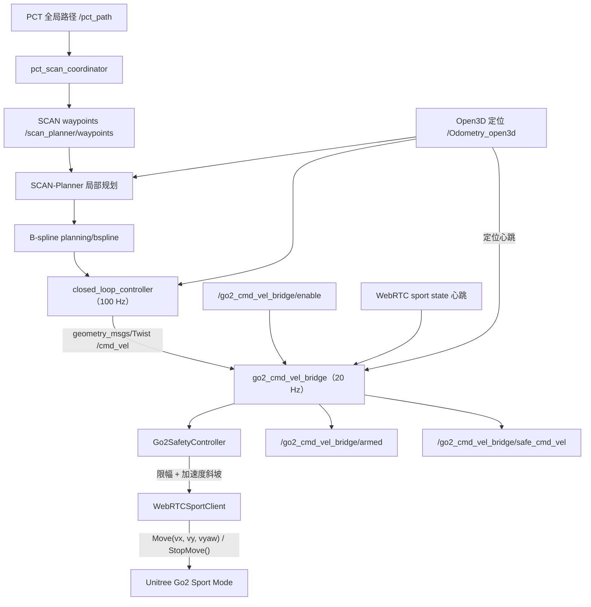
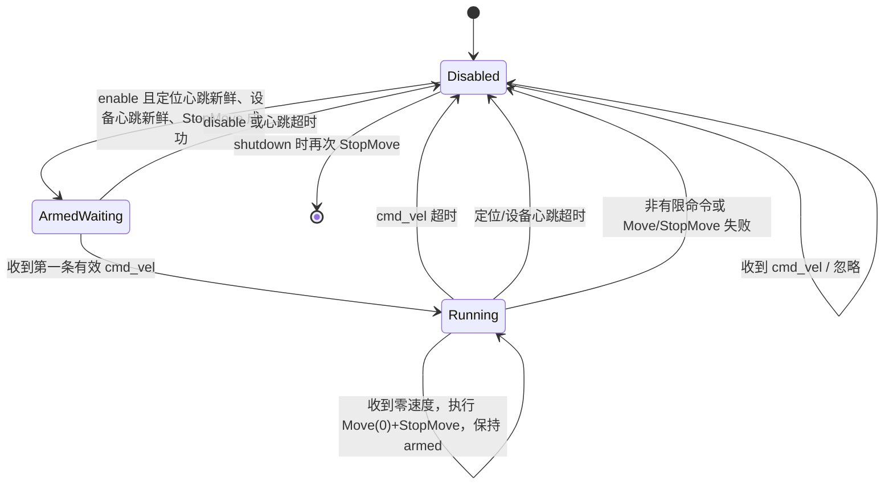
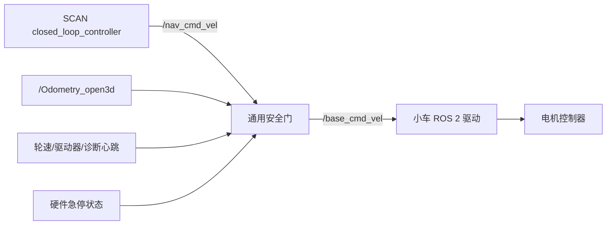

# kn_nav 底层控制与设备适配文档

> 文档日期：2026-08-14
>
> 项目目录：`/home/jetson/kn_nav`
>
> 当前设备：Unitree Go2
>
> 当前底层通信：ROS 2 `/cmd_vel` → Python 安全桥 → Unitree WebRTC Sport API

本文档回答两个问题：

1. 当前机器狗从局部轨迹到实际运动的完整控制链路是什么；
2. 后续更换普通小车、其他宇树机器狗或不同传输协议时，需要修改哪些代码、配置和测试。

文档只描述当前实现和建议改造方案，不代表 `A2`、`Go2-W` 或其他车型已经完成真机认证。

## 1. 当前机器狗控制链路

### 1.1 总体链路图



控制链可以分成四层：

| 层级 | 当前实现 | 职责 | 是否与具体设备耦合 |
|---|---|---|---|
| 路径层 | PCT + coordinator | 产生全局参考路径和 waypoint | 基本无关 |
| 局部规划层 | SCAN-Planner | 避障、重规划、产生 B-spline | 与机器人尺寸和运动能力有关 |
| 跟踪控制层 | `closed_loop_controller` | 根据轨迹和定位生成 `/cmd_vel` | 与底盘运动学有关 |
| 设备桥层 | `go2_cmd_vel_bridge.py` | 安全门、心跳、限幅、协议转换 | 强设备耦合 |

换设备时，不应修改 PCT 全局规划算法；主要修改 SCAN 参数、跟踪控制约束和设备桥。

### 1.2 SCAN 闭环控制器

代码：

```text
src/SCAN-Planner/src/planner/plan_manage/src/closed_loop_controller.cpp
```

输入：

| 接口 | 类型 | 作用 |
|---|---|---|
| `planning/bspline` | `scan_planner_msgs/msg/Bspline` | SCAN 生成的局部轨迹 |
| `body_pose` | `nav_msgs/msg/Odometry` | 当前机体位姿，统一 launch 中 remap 到 `/Odometry_open3d` |

输出：

| 接口 | 类型 | 作用 |
|---|---|---|
| `cmd_vel` | `geometry_msgs/msg/Twist` | 机体速度命令，统一 launch 下为 `/cmd_vel` |
| `planning/go2_execution_frozen` | `std_msgs/msg/Bool` | 航向误差过大时冻结轨迹时间推进 |

控制器定时周期为 10 ms，即约 100 Hz。主要处理过程：

1. 根据当前轨迹时间在 B-spline 上取期望位置和期望速度；
2. 使用 `期望速度 + kp_pos × 位置误差` 计算世界坐标系平面速度；
3. 根据 `/Odometry_open3d` 中的 yaw，把世界坐标速度旋转到机体坐标系；
4. 输出 `Twist.linear.x`、`Twist.linear.y` 和 `Twist.angular.z`；
5. 航向误差大于 `heading_error_threshold` 时，线速度置零，只原地旋转；
6. 到达终点位置后继续调整最终 yaw；
7. 位置和朝向都满足容差后持续发布零速度。

当前 `Twist` 语义：

| 字段 | 含义 | 单位 |
|---|---|---|
| `linear.x` | 机体前后速度，正值向前 | m/s |
| `linear.y` | 机体左右速度，按 ROS 约定正值向左 | m/s |
| `angular.z` | 绕机体 Z 轴角速度，按 ROS 约定正值逆时针 | rad/s |

更换设备后必须在架空或顶起状态验证实际轴向，不能只假定厂商坐标定义与 ROS 完全一致。

### 1.3 当前 Go2 bridge

主要代码：

```text
src/pct_scan_navigation/scripts/go2_cmd_vel_bridge.py
src/pct_scan_navigation/scripts/go2_safety_controller.py
src/pct_scan_navigation/scripts/webrtc_sport_client.py
```

配置：

```text
src/pct_scan_navigation/config/unitree_go2/go2_bridge.yaml
```

ROS 接口：

| 方向 | 接口 | 类型 | 说明 |
|---|---|---|---|
| 订阅 | `/cmd_vel` | `geometry_msgs/msg/Twist` | 上层控制器速度命令 |
| 订阅 | `/Odometry_open3d` | `nav_msgs/msg/Odometry` | 定位心跳及有限值检查 |
| 服务 | `/go2_cmd_vel_bridge/enable` | `std_srvs/srv/SetBool` | 正式模式使能/禁用 |
| 发布 | `/go2_cmd_vel_bridge/armed` | `std_msgs/msg/Bool` | 是否允许执行命令；transient local |
| 发布 | `/go2_cmd_vel_bridge/safe_cmd_vel` | `geometry_msgs/msg/Twist` | 限幅和斜坡后的实际请求 |

设备接口：

```python
Move(vx, vy, vyaw) -> int
StopMove() -> int
```

返回 0 表示成功，非 0 表示失败。

WebRTC 客户端启动时执行：

1. 使用 `LocalSTA` 和 `robot_ip` 连接 Go2；
2. 检查 motion mode，必要时切到 `normal`；
3. 调用 `FreeWalk`；
4. 正式模式订阅 sport state 心跳；
5. 控制循环中调用 `Move(x, y, z)`；
6. 零速、故障、disable 和 shutdown 时调用 `Move(0,0,0)` 与 `StopMove()`。

因此即使 bridge 尚未 armed，节点初始化也可能切换机器狗 motion mode 和 gait。首次接入真机时仍要保持现场安全，不能把“未 armed”理解为“完全不会改变设备状态”。

### 1.4 正式安全模式状态机



正式模式的 enable 前置条件：

1. 已收到有效 `/Odometry_open3d`；
2. 定位心跳没有超过 `odometry_timeout`；
3. 已收到 WebRTC sport state；
4. sport state 心跳没有超过 `sport_state_timeout`；
5. `Move(0,0,0)` 和 `StopMove()` 均成功。

运行中任一故障都会执行 Stop 并 disarm。故障后不会自动重新 armed，必须人工再次调用 enable。

### 1.5 bypass 模式

`bypass_safety:=true` 时：

- 启动即发布 armed 为 true；
- 不创建 `/go2_cmd_vel_bridge/enable` 服务；
- 不检查定位心跳和 sport state 心跳；
- 不执行加速度斜坡；
- 仍检查 NaN/Inf；
- 仍做速度 clamp；
- `/cmd_vel` 超过约 0.5 秒未更新时发送零速度；
- `Move` 失败后把缓存命令归零。

该模式不是另一种正式控制方式，只用于架空或受控调试。

### 1.6 当前控制参数及实际生效关系

当前 `unitree_go2/scan_planner.yaml`：

```yaml
closed_loop_controller:
  ros__parameters:
    time_forward: 0.60
    heading_error_threshold: 0.80
    kp_pos: 0.8
    kp_yaw: 1.5
    max_vx: 0.30
    max_vy: 0.30
    max_vyaw: 0.50
    finish_dist: 0.15
    finish_yaw: 0.10
```

当前 `unitree_go2/go2_bridge.yaml`：

```yaml
go2_cmd_vel_bridge:
  ros__parameters:
    robot_ip: "192.168.123.161"
    control_rate: 20.0
    min_vx: 0.0
    max_vx: 0.40
    max_abs_vy: 0.0
    max_abs_vyaw: 1.0
    max_linear_acceleration: 1.0
    max_yaw_acceleration: 1.2
    command_timeout: 0.3
    odometry_timeout: 1.0
    sport_state_timeout: 0.5
```

一条命令要同时通过控制器和 bridge 两层限制，最终有效范围取更严格的一层：

| 能力 | SCAN 输出限制 | bridge 限制 | 当前最终效果 |
|---|---:|---:|---:|
| 前进 | 0.30 m/s | 0.40 m/s | 最大约 0.30 m/s |
| 后退 | 允许到 -0.30 m/s | `min_vx=0.0` | 正式模式不后退 |
| 横移 | 0.30 m/s | `max_abs_vy=0.0` | 不横移 |
| 旋转 | 0.50 rad/s | 1.0 rad/s | 最大约 0.50 rad/s |

如果后续设备支持后退或横移，必须同时修改 SCAN controller 和设备 bridge；只改一侧不会完全生效。

### 1.7 当前启动绑定

统一 launch：

```text
src/pct_scan_navigation/launch/local_pct_scan_navigation.launch.py
```

当前 bridge 被硬编码为：

```python
Node(
    package='pct_scan_navigation',
    executable='go2_cmd_vel_bridge.py',
    name='go2_cmd_vel_bridge',
    parameters=[navigation_config('go2_bridge.yaml'), ...],
)
```

因此创建一个新 profile 只会切换 YAML，不会自动切换底层驱动程序。适配完全不同的设备时，还必须修改 launch 或增加可选择的 bridge launch 参数。

## 2. 更换设备时的总体原则

### 2.1 保持上层接口稳定

推荐把 `/cmd_vel` 作为上层和底层的稳定边界：

```text
PCT / SCAN / 定位
        ↓
geometry_msgs/Twist
        ↓
通用安全门
        ↓
设备协议适配器
        ↓
真实底盘
```

理想情况下：

- PCT 不因换底盘而修改；
- coordinator 不因换底盘而修改；
- SCAN 只修改机器人尺寸、动力学参数和必要的运动学约束；
- 底层 bridge 负责 ROS `Twist` 到厂商命令的转换；
- 安全状态机独立于 WebRTC、DDS、CAN、串口或厂商 ROS driver。

### 2.2 建议先做通用化改造

当前文件和接口大量使用 `go2` 名称。新增第二种设备前，建议先抽象为：

```text
/nav_cmd_vel                 上层导航原始命令
/base_controller/enable     通用使能服务
/base_controller/armed      通用 armed 状态
/base_controller/safe_cmd_vel
/base_controller/fault      建议新增故障原因
/base_cmd_vel                安全门输出给 ROS 底盘驱动的命令
```

为了兼容现有 Web API和操作习惯，可以暂时保留：

```text
/go2_cmd_vel_bridge/enable
/go2_cmd_vel_bridge/armed
/go2_cmd_vel_bridge/safe_cmd_vel
```

但新代码内部应使用通用命名，并通过 remap 或兼容代理暴露旧接口。

推荐的代码边界：

```python
class BaseTransport:
    def connect(self) -> bool: ...
    def move(self, vx: float, vy: float, wz: float) -> bool: ...
    def stop(self) -> bool: ...
    def healthy(self) -> bool: ...
    def close(self) -> None: ...
```

通用安全控制器只依赖以上抽象，不直接 import Unitree WebRTC。

### 2.3 先确定新设备的运动学类型

| 类型 | `linear.x` | `linear.y` | `angular.z` | 与当前控制器兼容度 |
|---|---|---|---|---|
| 差速/滑移小车 | 支持 | 不支持，应固定 0 | 支持，可原地转 | 高 |
| 全向/麦克纳姆小车 | 支持 | 支持 | 支持 | 高 |
| 四足机器狗 | 通常支持 | 依机型/步态 | 支持 | 较高，但需厂商适配器 |
| 阿克曼小车 | 支持 | 不支持 | 不能直接原地转 | 低，需要运动学改造 |

当前闭环控制器在航向误差过大时会发布“线速度为零、只有 `angular.z`”的原地旋转命令。因此它天然适合差速、滑移、全向和可原地转向的四足，不天然适合阿克曼车辆。

### 2.4 每种新设备都必须明确的参数

#### 几何参数

- 车体/机身长度、宽度、高度；
- 碰撞半径；
- 传感器相对 `base_link` 的外参；
- 轮距、轴距、轮径（轮式设备）；
- 是否能原地转向；
- 是否能横移；
- 最小转弯半径。

#### 动力学参数

- 最大前进、后退、横移速度；
- 最大角速度；
- 最大线加速度和角加速度；
- 制动距离；
- 指令频率要求；
- 厂商 watchdog 超时时间。

#### 通信和安全参数

- IP、网卡、CAN 口或串口；
- 命令类型和单位；
- 设备状态/故障/急停 topic；
- 心跳频率；
- 断线后的设备行为；
- enable、disable、clear fault 的调用方式；
- Stop 命令是否阻塞、是否有确认返回。

## 3. 更换为普通小车

### 3.1 推荐控制链

如果小车已经有 ROS 2 驱动并订阅 `geometry_msgs/msg/Twist`，推荐：



不要让安全门同时订阅和发布 `/cmd_vel`，否则会形成自己订阅自己输出的环路。建议：

- SCAN 输出 remap 为 `/nav_cmd_vel`；
- 安全门订阅 `/nav_cmd_vel`；
- 安全门输出 `/base_cmd_vel`；
- 把厂商驱动原来的 `/cmd_vel` remap 到 `/base_cmd_vel`。

### 3.2 新建机器人 profile

以差速小车 `my_diff_car` 为例：

```bash
cd /home/jetson/kn_nav/src/pct_scan_navigation/config
cp -a unitree_go2 my_diff_car
```

至少修改：

```text
config/my_diff_car/scan_planner.yaml
config/my_diff_car/fast_lio.yaml
config/my_diff_car/open3d_loc.yaml
config/my_diff_car/map_profiles.yaml
config/my_diff_car/pct_global_planner.yaml
```

`go2_bridge.yaml` 不应继续沿用，建议新建：

```text
config/my_diff_car/base_bridge.yaml
```

### 3.3 修改 SCAN 机器人尺寸

文件：

```text
src/pct_scan_navigation/config/my_diff_car/scan_planner.yaml
```

重点参数：

```yaml
grid_map.double_cylinder_radius: <按车宽和安全余量计算>
grid_map.double_cylinder_offset: <按车长和模型计算>
grid_map.body_height: <车体高度>
grid_map.obstacles_inflation_z_up: <上方安全余量>
grid_map.obstacles_inflation_z_down: <下方安全余量>

manager.max_vel: <规划最大速度>
manager.max_acc: <规划最大加速度>
optimization.max_vel: <轨迹优化最大速度>
optimization.max_acc: <轨迹优化最大加速度>
```

碰撞模型和速度必须按实车测量，不能直接复制 Go2 参数。

### 3.4 修改闭环控制参数

#### 差速/滑移小车

```yaml
closed_loop_controller:
  ros__parameters:
    max_vx: <低速起步，例如 0.10>
    max_vy: 0.0
    max_vyaw: <低速起步，例如 0.20>
```

差速车必须禁止横移。当前控制器仍会计算二维世界速度，但 `max_vy: 0.0` 会把机体横向命令限制为 0。需要实测弯道跟踪是否满足；若路径包含强横移成分，应进一步修改局部规划或使用适配差速运动学的控制器。

#### 全向/麦克纳姆小车

可以保留 `max_vy > 0`，但必须验证：

- 厂商驱动的 Y 轴符号；
- 横移加速度；
- 轮胎侧滑；
- 局部地图碰撞模型；
- 横移时传感器盲区。

#### 阿克曼小车

不能只写一个 bridge 把 `angular.z` 当转角。至少需要：

1. 禁止原地旋转逻辑；
2. 根据轴距和线速度把曲率转换为转向角；
3. 限制最小转弯半径和转角速度；
4. 让局部规划产生满足非完整约束的轨迹；
5. 重新设计终点朝向对齐，不能在终点原地转 yaw。

如果不修改 SCAN 的运动模型，阿克曼车可能收到物理上不可执行的轨迹。

### 3.5 编写小车安全桥

建议新增：

```text
src/pct_scan_navigation/scripts/base_cmd_vel_safety_gate.py
```

它应至少完成：

1. 订阅 `/nav_cmd_vel`；
2. 订阅 `/Odometry_open3d`；
3. 订阅真实底盘心跳或 diagnostics；
4. 订阅硬件急停状态；
5. 提供 enable/disable 服务；
6. 检查 NaN/Inf；
7. 限制速度和加速度；
8. 命令超时立即发布零速度并 disarm；
9. 定位丢失、驱动故障、急停触发时停止；
10. 发布 armed、safe_cmd_vel 和 fault reason。

对于 ROS 小车驱动，设备适配器的核心通常是发布：

```python
self.base_cmd_pub.publish(safe_twist)
```

Stop 至少需要连续发布若干次零速度，并确认厂商驱动 watchdog 和电机使能行为。不能只发布一次零速度就假设车辆已经停止。

### 3.6 修改 launch

当前统一 launch 把 controller 和 Go2 bridge 写死。建议新增参数：

```text
base_driver_type:=go2_webrtc | ros_twist | unitree_sdk2 | none
nav_cmd_vel_topic:=/nav_cmd_vel
base_cmd_vel_topic:=/base_cmd_vel
```

对小车模式，至少要做以下 remap：

```python
controller = Node(
    ...,
    remappings=[
        ('body_pose', '/Odometry_open3d'),
        ('cmd_vel', '/nav_cmd_vel'),
    ],
)
```

安全门订阅 `/nav_cmd_vel`，输出 `/base_cmd_vel`；厂商小车驱动订阅 `/base_cmd_vel`。

同时修改 `nav_manager_node` 参数：

```python
{'cmd_vel_topic': '/nav_cmd_vel'}
```

否则 nav manager 软复位仍向旧 `/cmd_vel` 发布零速度，不能经过新的安全门。

新增 Python bridge 后，还要在以下文件安装脚本：

```text
src/pct_scan_navigation/CMakeLists.txt
```

示意：

```cmake
install(PROGRAMS
  scripts/base_cmd_vel_safety_gate.py
  DESTINATION lib/${PROJECT_NAME}
)
```

然后重新编译：

```bash
cd /workspace/kn_nav_ws
source /opt/ros/humble/setup.bash
colcon build --symlink-install --packages-select pct_scan_navigation
source install/setup.bash
```

### 3.7 小车反馈不能只看定位

当前 Go2 安全控制器把 `/Odometry_open3d` 当作一个安全心跳，但它只能说明定位节点在更新，不能证明电机驱动、CAN 或轮控在线。

换小车后建议同时检查：

- 定位心跳：`/Odometry_open3d`；
- 底盘里程计：例如 `/wheel_odom`；
- 驱动诊断：`/diagnostics` 或厂商状态 topic；
- 硬件急停状态；
- 电机 enable 状态；
- 控制器故障码。

enable 应要求定位和真实设备心跳都正常。

## 4. 更换为其他宇树机器狗

### 4.1 先判断是否真正兼容现有 WebRTC Sport API

现有 bridge 依赖：

- `unitree_webrtc_connect`；
- `UnitreeWebRTCConnection(LocalSTA, ip=...)`；
- `SPORT_CMD['Move']`、`StopMove`、`FreeWalk`；
- `RTC_TOPIC['SPORT_MOD']`；
- `RTC_TOPIC['LF_SPORT_MOD_STATE']`；
- motion switcher 的 normal mode。

只有新设备同时支持这些接口、参数含义和状态 topic，才可能复用 `WebRTCSportClient`。机型同属宇树品牌并不代表协议完全相同。

### 4.2 同协议 Go2 或同型号换机

如果只是另一台 Go2，通常修改：

1. `go2_bridge.yaml` 的 `robot_ip`；
2. 雷达/IMU 外参；
3. 机器人尺寸和速度限制；
4. 地图和定位参数；
5. 网络和 WebRTC 心跳超时。

先把速度降到很低：

```yaml
max_vx: 0.10
max_abs_vy: 0.0
max_abs_vyaw: 0.20
max_linear_acceleration: 0.10
max_yaw_acceleration: 0.20
```

完成轴向、Stop、断网和急停测试后再逐步放开。

### 4.3 Go2-W 和 A2 profile 的现状

仓库已有：

```text
config/unitree_go2w/
config/A2/
launch/unitree_go2w_pct_scan_navigation.launch.py
launch/unitree_A2_pct_scan_navigation.launch.py
```

但两个 profile 的统一 launch 最终仍启动：

```text
pct_scan_navigation/go2_cmd_vel_bridge.py
```

配置也仍使用：

```yaml
robot_ip: "192.168.123.161"
```

这表示当前主要完成了尺寸和速度 profile，不能证明 Go2-W 或 A2 的底层通信、运动命令、心跳和真机安全已经验证。尤其 A2 launch 文件的文件头仍写着 Go2-W，说明该 profile 需要重新审计。

### 4.4 使用 Unitree SDK2/DDS

仓库中保留了一套 C++ SDK2 bridge：

```text
src/pure_pursuit_planner/src/go2_cmd_vel_bridge.cpp
src/pure_pursuit_planner/src/go2_safety_controller.cpp
```

它使用：

- `unitree_sdk2`；
- `unitree::robot::ChannelFactory`；
- `unitree::robot::go2::SportClient`；
- `rt/sportmodestate`；
- `network_interface` 和 DDS domain。

但 `src/pure_pursuit_planner/COLCON_IGNORE` 当前使整个包不参与构建。不要直接删除 `COLCON_IGNORE` 就用于真机。建议：

1. 把通用安全状态机提取到独立包；
2. 新建只负责 SDK2 通信的 `unitree_sdk2_transport`；
3. 根据目标机型使用对应的 SDK 消息和 SportClient；
4. 校验厂商 DDS domain，避免与 ROS 2 `ROS_DOMAIN_ID` 概念混淆；
5. 确认 `rt/sportmodestate` 的真实频率和 QoS；
6. 为 Move、Stop、心跳丢失和返回码建立自动测试；
7. 架空低速验证后再接入导航。

SDK2 bridge 当前参数和 WebRTC bridge 不同：

| WebRTC 版本 | SDK2/DDS 版本 |
|---|---|
| `robot_ip` | `network_interface` |
| LocalSTA WebRTC | Unitree DDS channel |
| RTC sport state | `rt/sportmodestate` |
| Python | C++ |

当前统一 launch 虽声明了 `network_interface`，但 Python WebRTC bridge没有读取它。只有真正切换到 SDK2/DDS bridge 后，该参数才有意义。

### 4.5 B2、A2、G1 或其他宇树机型

按以下顺序适配：

1. 查目标机型 SDK 中的速度控制接口，不要复制 Go2 头文件；
2. 确认高层运动模式是否提供 `Move(vx, vy, yaw_rate)`；
3. 确认机型是否支持横移、原地转向和后退；
4. 确认进入运动模式、站立、步态切换的正确状态机；
5. 确认设备状态 topic、频率、故障码和急停状态；
6. 实现该机型专用 transport；
7. 复用通用安全门，而不是复制一套新的安全逻辑；
8. 创建独立配置 profile 和 launch wrapper；
9. 从极低速度开始验证。

建议命名：

```text
config/unitree_b2/
config/unitree_a2/
config/unitree_g1/

scripts/unitree_sdk2_bridge.py 或独立 C++ package
launch/unitree_b2_pct_scan_navigation.launch.py
```

不要继续把所有宇树设备都命名成 `go2_cmd_vel_bridge`，否则日志、服务和故障定位会混淆。

## 5. 需要修改的文件清单

### 5.1 只换同型号 Go2

| 文件 | 修改内容 |
|---|---|
| `config/unitree_go2/go2_bridge.yaml` | IP、速度、加速度、超时 |
| `config/unitree_go2/scan_planner.yaml` | 尺寸、局部规划速度、controller 限制 |
| `config/unitree_go2/fast_lio.yaml` | 雷达/IMU topic 和外参 |
| `config/unitree_go2/open3d_loc.yaml` | IMU/base 外参、地图 |

通常不需要修改 PCT 和 coordinator 源码。

### 5.2 换成兼容 Twist 的差速/全向小车

| 文件/模块 | 操作 |
|---|---|
| `config/<new_profile>/scan_planner.yaml` | 修改尺寸、速度、横移能力 |
| `config/<new_profile>/base_bridge.yaml` | 新建设备和安全参数 |
| `scripts/base_cmd_vel_safety_gate.py` | 新建通用 ROS Twist 安全门 |
| `launch/local_pct_scan_navigation.launch.py` | 增加 driver 选择和 topic remap |
| `scripts/nav_manager_node.py` 或 launch 参数 | 软停止 topic 改为 `/nav_cmd_vel` |
| `CMakeLists.txt` | 安装新脚本 |
| `package.xml` | 增加厂商消息/diagnostic 依赖 |
| 新设备 launch wrapper | 固定 profile 和底盘驱动 |

### 5.3 换成其他宇树机型

除新 profile 外，还需要：

| 文件/模块 | 操作 |
|---|---|
| transport | 按机型实现 WebRTC 或 SDK2/DDS 调用 |
| heartbeat | 订阅目标机型真实状态 topic |
| posture/gait | 按目标机型重新设计初始化顺序 |
| safety | 复用通用状态机并增加设备故障、急停输入 |
| launch | 选择正确 transport，不再硬编码 Go2 bridge |
| tests | 模拟设备返回码、断线、超时和 Stop 失败 |

## 6. 适配后的测试与验收

### 6.1 第一阶段：无硬件单元测试

必须覆盖：

1. 未 enable 时忽略非零命令；
2. 无定位心跳时 enable 失败；
3. 无设备心跳时 enable 失败；
4. enable 先发送 Stop；
5. NaN/Inf 导致 Stop 和 disarm；
6. 速度上下限正确；
7. 横向速度能力正确；
8. 加速度斜坡正确；
9. `/cmd_vel` 超时导致 Stop 和 disarm；
10. 定位、设备心跳超时导致 Stop 和 disarm；
11. Move/Stop 失败导致 fault；
12. shutdown 一定调用 Stop；
13. 故障后必须人工重新 enable。

设备 transport 使用 mock，不连接真机。

### 6.2 第二阶段：只启动厂商驱动

不要启动 PCT/SCAN。使用受控命令测试：

```bash
# 示例：发布很小的前进速度，实际 topic 按新架构调整
ros2 topic pub --rate 10 /nav_cmd_vel geometry_msgs/msg/Twist \
  "{linear: {x: 0.05, y: 0.0, z: 0.0}, angular: {x: 0.0, y: 0.0, z: 0.0}}"
```

逐项验证：

- 正 X 是否向前；
- 正 Y 是否向左，或是否被正确禁止；
- 正 angular.z 是否逆时针；
- 停止发布后是否在预定超时内停止；
- disable 是否立即停止；
- 断开网络/CAN 是否停止；
- 驱动报错是否 disarm；
- 实体急停是否独立有效。

所有测试从轮子悬空、机器狗架空或有安全绳状态开始。

### 6.3 第三阶段：上层闭环但不接动力

启动定位、PCT、SCAN，但让安全门保持 disabled：

```bash
ros2 topic echo /nav_cmd_vel
ros2 topic echo /base_controller/safe_cmd_vel
```

检查路径和速度方向，不允许设备运动。

### 6.4 第四阶段：低速真机

建议初始限制：

```text
最大线速度：0.05～0.10 m/s
最大角速度：0.10～0.20 rad/s
最大线加速度：0.05～0.10 m/s²
```

测试顺序：

1. 前进；
2. 停止；
3. 后退（若允许）；
4. 左右转；
5. 横移（若允许）；
6. 直线目标；
7. 90° 转弯；
8. 终点朝向对齐；
9. 局部障碍停车；
10. 定位丢失；
11. 命令断流；
12. 网络断开；
13. 实体急停。

### 6.5 验收标准

- 不 enable 时任何导航命令都不能使设备运动；
- enable 前必须同时具备定位和设备心跳；
- 命令、定位或设备心跳超时后在设计时间内停止；
- 速度和加速度不超过配置；
- 坐标轴方向与 ROS 约定一致；
- 路径不要求设备执行其不具备的横移/原地转向；
- Stop、disable、shutdown 和实体急停均经过测试；
- 故障原因可被日志或 topic 查询；
- 完成空旷场、窄通道、转弯和终点姿态回归；
- 配置、测试日期、设备序列号和代码 commit 已归档。

## 7. 当前实现中需要特别注意的问题

### 7.1 `network_interface` 对当前 Python bridge 无效

统一 launch 声明了 `network_interface`，但 `go2_cmd_vel_bridge.py` 实际读取 `go2_bridge.yaml` 中的 `robot_ip`。换设备时不要误以为传 `network_interface:=eth0` 就会切换连接。

### 7.2 Go2 命名已经渗透到通用模块

`planning/go2_execution_frozen` 实际是闭环控制器的通用“航向对齐冻结”状态，与 Go2 硬件无直接关系。建议改名为：

```text
planning/execution_frozen
```

并在过渡期保留 remap。

### 7.3 当前正式配置禁止后退和横移

`min_vx=0.0`、`max_abs_vy=0.0` 会把 SCAN 产生的负 X 和 Y 命令截断。换差速车时禁止横移合理，但是否允许后退需要单独决定；换全向设备时要同时放开 controller 和 bridge。

### 7.4 WebRTC RPC 超时和安全响应时间不完全一致

当前 Move/StopMove 单次 WebRTC 调用最多可能等待 10 秒，而 sport state 超时仅 0.5 秒。由于控制 tick 会等待 RPC 返回，网络严重卡顿时，实际 Stop/故障处理时延可能大于 YAML 中的心跳超时。后续通用化时应：

- 让传输调用非阻塞或设置更短、可配置的命令 deadline；
- 把 watchdog 下沉到设备驱动或控制器；
- 独立线程处理状态心跳和急停；
- 测量而不是假定最坏停止时间。

### 7.5 定位心跳不等于硬件心跳

`/Odometry_open3d` 正常不能证明电机控制器正常。新设备适配必须增加真实设备状态输入。

### 7.6 bypass 没有 enable/disable 服务

bypass 启动即 armed。此时操作脚本如果调用 disable 服务会找不到服务。紧急停止依赖实体急停、终止 launch 或停止容器，不得用于正式部署。

### 7.7 现有 A2/Go2-W 配置不等于完成适配

两者仍调用 Go2 WebRTC bridge。必须分别完成协议、状态 topic、轴向、步态、Stop 和故障注入测试后才能标记为支持。

## 8. 推荐的最终目录结构

完成通用化后建议拆成：

```text
src/
├── pct_scan_navigation/
│   ├── config/
│   │   ├── unitree_go2/
│   │   ├── unitree_b2/
│   │   ├── diff_car/
│   │   └── omni_car/
│   └── launch/
├── base_control_core/
│   ├── 通用安全状态机
│   ├── 通用 enable/armed/fault 接口
│   └── 单元测试
├── unitree_webrtc_transport/
├── unitree_sdk2_transport/
├── ros_twist_base_transport/
└── vendor_x_base_transport/
```

这种结构把安全逻辑与厂商协议分离，新增设备时只实现 transport 和 profile，避免复制并逐渐分叉多套安全控制代码。

## 9. 快速决策表

| 更换场景 | 是否改 PCT | 是否改 SCAN 参数 | 是否改 closed-loop | 是否新写 bridge |
|---|---:|---:|---:|---:|
| 同型号 Go2 换机 | 否 | 可能 | 通常否 | 否，改 IP/参数 |
| Go2 改走 SDK2/DDS | 否 | 可能 | 通常否 | 是 |
| 支持同样 Sport API 的宇树狗 | 否 | 是 | 可能 | 至少审计/扩展 |
| 不同 Sport API 的宇树狗 | 否 | 是 | 可能 | 是 |
| 差速/滑移小车 | 否 | 是 | 可能 | 是或加通用安全门 |
| 全向/麦克纳姆小车 | 否 | 是 | 少量 | 是或加通用安全门 |
| 阿克曼小车 | 否 | 是 | 是 | 是 |

最重要的判断不是“品牌是否相同”，而是：运动学能力、命令接口、状态反馈和故障停止机制是否相同。
